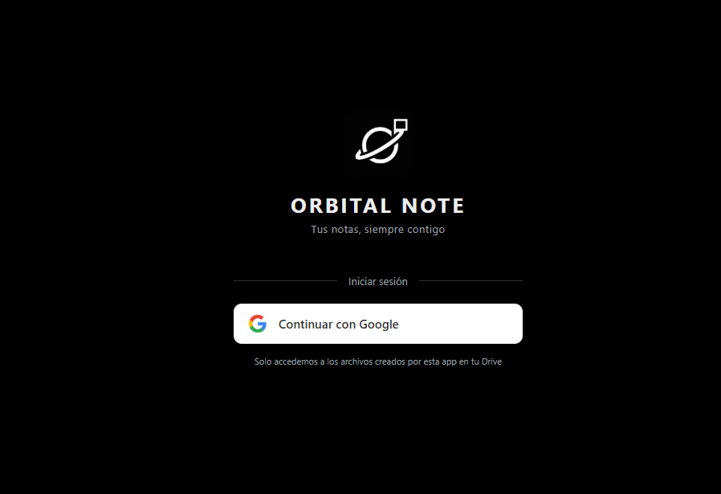
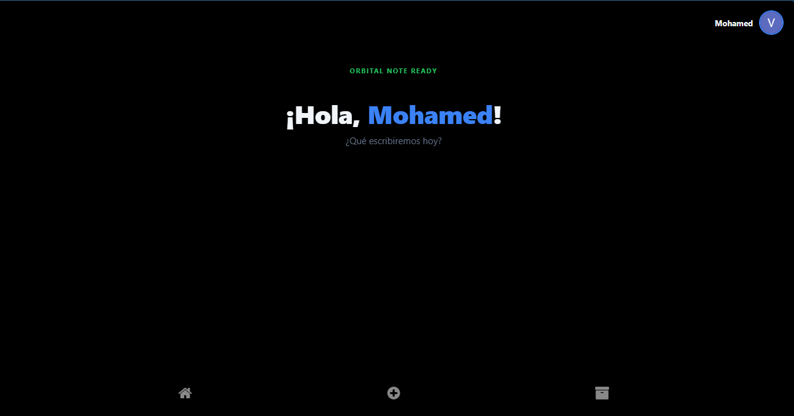
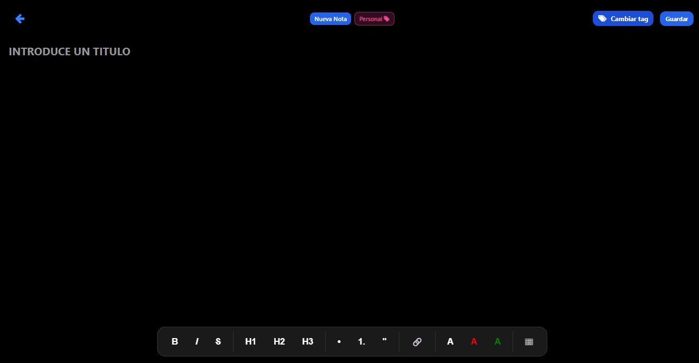
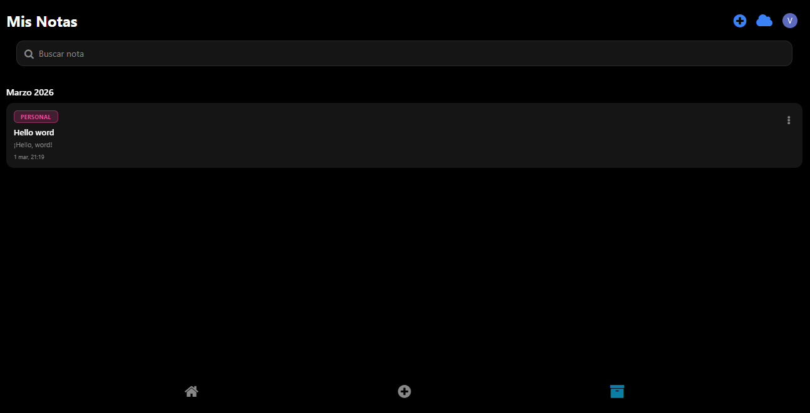

# Orbital Note

A cross-platform note-taking application built with Expo and React Native, featuring Google OAuth authentication and Google Drive synchronization.

<div align="center">

**[🚀 Live Orbital Note](https://orbitalnote.online)** | **[📖 Documentation](https://docs.orbitalnote.online)** 

</div>

## 📋 Overview

Orbital Note is a modern, cloud-synchronized note-taking app available on **Android** and **Web**. It provides users with a seamless experience across devices using Google authentication and real-time synchronization with Google Drive. The app features a rich text editor with support for mentions, tags, and cross-note references.

## 🎯 Features

- 🔐 **Google OAuth Authentication** - Secure login via Google Account
- ☁️ **Google Drive Sync** - Automatic synchronization of notes
- 📝 **Rich Text Editor** - TipTap on web, TenTap on mobile with formatting tools
- 🎯 **Cross-Platform** - Native Android and web support
- 📱 **Responsive Design** - Optimized for all screen sizes
- ⚡ **Type-Safe** - Full TypeScript support
- 🏷️ **Tags & Colors** - Organize notes with customizable tags
- 🔗 **Note References** - Link and navigate between related notes

## 📸 Screenshots

| Login               | Home                 | Editor                 | List                 |
| ------------------- | -------------------- | ---------------------- | -------------------- |
|  |  |  |  |

---

## 🏗️ Architecture Overview

### Architecture Pattern

Orbital Note follows a **Feature-Based Modular Architecture** with clear separation of concerns:

```
┌─────────────────────────────────────────────────────────────┐
│                    EXPO ROUTER (Navigation)                  │
├─────────────────────────────────────────────────────────────┤
│            PRESENTATION LAYER (Components & Views)           │
├──────────────────┬──────────────────┬──────────────────────┤
│   UI Components  │  Custom Hooks    │   Display Components  │
├─────────────────────────────────────────────────────────────┤
│           STATE MANAGEMENT (React Context)                   │
│                   (UserContext, Theme)                       │
├─────────────────────────────────────────────────────────────┤
│               BUSINESS LOGIC LAYER (Services)                │
│        (Auth, Drive Sync, Token Management)                 │
├─────────────────────────────────────────────────────────────┤
│            DATA LAYER (AsyncStorage + Google Drive)          │
└─────────────────────────────────────────────────────────────┘
```

### Directory Structure

```
orbital-note/
│
├── app/                              # Expo Router Pages
│   ├── _layout.tsx                   # Root layout with providers
│   ├── (auth)/
│   │   └── login.tsx                 # Google OAuth login screen
│   │
│   └── (app)/                        # Main app stack
│       ├── index.tsx                 # Home view (notes list)
│       ├── editorview.tsx            # Note editor
│       ├── listview.tsx              # Full notes list view
│       ├── Viewnote.tsx              # Note detail view
│       ├── menu.tsx                  # Menu/settings
│       └── App.tsx                   # App shell
│
├── components/                       # Reusable UI Components
│   ├── FloatingNavBar.tsx            # Bottom navigation bar
│   ├── GlobalNotesSidebar.tsx        # Side panel with notes
│   ├── TextEditorToolbar.tsx         # Editor formatting toolbar
│   ├── WebEditor.tsx                 # Web-specific editor
│   ├── WebToolbar.tsx                # Web editor toolbar
│   ├── MentionSuggestions.tsx        # @mention autocomplete
│   ├── MentionNavigationButtons.tsx  # Navigation for mentions
│   ├── SafeAreaProvider.tsx          # Safe area wrapper
│   │
│   └── modal/                        # Modal dialogs
│       ├── CustonAlert.tsx           # Custom alert modal
│       ├── Success.tsx               # Success notification
│       ├── logout/
│       │   └── LogoutModal.tsx       # Logout confirmation
│       └── saveNote/
│           └── saveNote.tsx          # Save note dialog
│
├── context/                          # State Management
│   └── UserContext.tsx               # User auth state & storage keys
│
├── services/                         # Business Logic & APIs
│   ├── auth/
│   │   └── useAuth.ts                # Google OAuth hook
│   ├── tokenStorage.ts               # Token persistence
│   └── sincronizarWithDrive.ts       # Google Drive API integration
│
├── hooks/                            # Custom React Hooks
│   ├── use-color-scheme.ts           # System color scheme detection
│   ├── use-color-scheme.web.ts       # Web-specific color scheme
│   ├── use-theme-color.ts            # Theme color management
│   ├── use-theme-context.ts          # Theme context hook
│   └── use-theme.tsx                 # Theme provider & hook
│
├── display/                          # Display Components
│   ├── HomeView.tsx                  # Home page layout
│   └── ListView.tsx                  # List view layout
│
├── extensions/                       # Editor Extensions
│   ├── BlockId.ts                    # Block ID tiptap extension
│   └── NoteMention.ts                # Note mention tiptap extension
│
├── utils/                            # Utility Functions
│   ├── referenceManager.ts           # Handle note references
│   └── tagColors.ts                  # Tag color utilities
│
├── types/                             # TypeScript Definitions
│   └── types.ts                      # Global type definitions
│
├── constants/                        # App Constants
│   └── theme.ts                      # Theme configuration
│
├── assets/                           # Static Assets
│   └── images/                       # App icons & images
│
└── android/                          # Android Native Config
    └── app/                          # Android app module
```

---

## 📊 Data Flow Architecture

### 1. Authentication Flow

```
┌─────────────┐
│  User Login │
│   Screen    │
└──────┬──────┘
       │
       ▼ (Tap "Login with Google")
┌──────────────────────────────────────┐
│  useAuth Hook                        │
│  - Google OAuth Request              │
│  - Handle redirect                   │
└──────────────────┬───────────────────┘
                   │
                   ▼ (Success)
┌─────────────────────────────────────────┐
│  ServiceLoginWithGoogle                 │
│  - Get access token                     │
│  - Fetch user info (Google API)         │
│  - Decrypt user data if exists          │
└──────────────────┬──────────────────────┘
                   │
                   ▼
┌───────────────────────────────────────┐
│  UserContext.setUser()                │
│  - Store user in state                │
│  - Persist to AsyncStorage            │
│  - Save token with expiration         │
└───────────────────────────────────────┘
                   │
                   ▼
             Logged In
           Redirect to /App
```

### 2. Note Management Flow

```
┌──────────────────────────┐
│  Notes List View         │
│  (index.tsx)             │
└────────┬─────────────────┘
         │
    ┌────┴─────┬──────────┬──────────┐
    │           │          │          │
    ▼           ▼          ▼          ▼
 Create      Update      Delete    Navigate
   Note        Note       Note       Note
    │           │          │          │
    └────┬──────┴──────┬───┴──────────┘
         │             │
         ▼             ▼
   ┌──────────────────────────────┐
   │  AsyncStorage                │
   │  (Local persistence)         │
   │  - Notes list                │
   │  - Tags                      │
   └────────┬─────────────────────┘
            │
            ▼
   ┌──────────────────────────────┐
   │  Google Drive Sync           │
   │  (subirArchivoADrive)        │
   │  - Upload JSON files         │
   │  - Sync across devices       │
   └──────────────────────────────┘
```

### 3. State Management

```
┌─────────────────────────────────────┐
│        Root Provider                │
│   (_layout.tsx)                     │
└────────┬────────────────────────────┘
         │
    ┌────┴────┬──────────┬──────────┐
    │          │          │          │
    ▼          ▼          ▼          ▼
 UserProvider ThemeProvider SafeAreaProvider App Stack
    │
    ▼
┌──────────────────────────────────────┐
│  UserContext                         │
│  ├─ user: User | null               │
│  ├─ setUser(user)                   │
│  ├─ clearUser()                     │
│  └─ isLoading: boolean              │
└──────────────────────────────────────┘
```

---

##  Core Data Models

### User Model

```typescript
interface User {
  id: string;                    // Google user ID
  name: string;                  // Full name
  email: string;                 // Email address
  picture: string;               // Avatar URL
  given_name?: string;           // First name
  family_name?: string;          // Last name
}
```

### Note Model

```typescript
interface Note {
  id: string;                    // Unique note ID
  title: string;                 // Note title
  content: string;               // Rich text content (JSON)
  tag: string;                   // Primary tag
  tagColor?: string;             // Tag color hex
  date: string;                  // Creation date
  modifiedAt?: string;           // Last modification
  references?: {
    outgoing: string[];          // IDs of mentioned notes
    incoming: string[];          // IDs that mention this note
  };
  blocks?: Block[];              // Block-level content
}

interface Block {
  id: string;                    // Block unique ID
  type: 'paragraph' | 'heading' | 'blockquote' | 'list';
  content: string;               // Block content
}
```

### ViewState

```typescript
type ViewState = 'HOME' | 'LIST' | 'EDITOR';
```

---

## 🔌 Key Services & Integrations

### 1. **Google OAuth (useAuth.ts)**

**Purpose**: Manage Google authentication flow

```typescript
// Scopes requested:
- openid
- profile
- email
- https://www.googleapis.com/auth/drive.appdata
- https://www.googleapis.com/auth/drive.file
```

**Flow**:
1. Detect platform (web/android)
2. Build appropriate redirect URI
3. Request OAuth token with Google
4. Save token to secure storage
5. Fetch user profile
6. Update UserContext

**Platform Support**:
- Web: Redirect to `{origin}/login`
- Android: Deep link via `orbitalnote://login`

---

### 2. **Google Drive Sync (sincronizarWithDrive.ts)**

**Purpose**: Synchronize notes between devices via Google Drive

**Key Functions**:

| Function                   | Purpose                          |
| -------------------------- | -------------------------------- |
| `subirArchivoADrive()`     | Upload/update note file to Drive |
| `buscarArchivoPorNombre()` | Find existing note file          |
| `googleApiFetch()`         | Authenticated fetch wrapper      |
| `getValidAccessToken()`    | Get valid token or throw error   |

**Sync Strategy**:
- Create/update JSON files in Drive
- Search by filename (note ID)
- Handle token expiration (401 -> logout)
- Bi-directional sync with AsyncStorage

---

### 3. **Token Storage (tokenStorage.ts)**

**Purpose**: Secure token persistence

**Storage Keys**:
- `google_access_token` - OAuth access token
- `google_token_expiry` - Expiration timestamp
- `google_user` - User profile JSON

**Features**:
- Auto-expiration handling
- Encrypted storage (native platform)
- Cross-platform compatibility

---

## 🎨 UI Component Hierarchy

### Navigation Structure

```
RootLayout
├── <Redirect> (if not authenticated)
├── LoginStack
│   └── login.tsx
│       ├── Google OAuth button
│       └── Loading indicator
│
└── AppStack (authenticated)
    ├── _layout (App shell)
    │   ├── FloatingNavBar (bottom tabs)
    │   └── GlobalNotesSidebar (side panel)
    │
    ├── index.tsx (Home)
    │   └── HomeView
    │       ├── Featured notes
    │       └── Recent notes
    │
    ├── listview.tsx (All Notes)
    │   └── ListView
    │       ├── Search/filter
    │       ├── Notes list
    │       └── Tag navigation
    │
    ├── editorview.tsx (Editor)
    │   ├── WebEditor (web) | TenTap (mobile)
    │   ├── TextEditorToolbar
    │   ├── MentionSuggestions
    │   └── Save modal
    │
    ├── Viewnote.tsx (Detail)
    │   ├── Note content
    │   ├── MentionNavigationButtons
    │   └── Tag display
    │
    └── menu.tsx (Menu)
        ├── Settings
        └── LogoutModal
```

---

## 🛠️ Tech Stack Details

| Category       | Technology                      | Purpose                         |
| -------------- | ------------------------------- | ------------------------------- |
| **Runtime**    | Expo 54.0+                      | Cross-platform mobile framework |
| **Language**   | TypeScript 5+                   | Type-safe development           |
| **Navigation** | Expo Router                     | File-based routing              |
| **State**      | React Context API               | User & theme state              |
| **Storage**    | AsyncStorage                    | Local persistent storage        |
| **Auth**       | Google OAuth 2.0                | Authentication                  |
| **Cloud**      | Google Drive API v3             | Cloud synchronization           |
| **Editors**    | TipTap (web)<br>TenTap (mobile) | Rich text editing               |
| **UI**         | React Native                    | Native UI components            |
| **Icons**      | @expo/vector-icons              | Icon library                    |
| **Safe Area**  | react-native-safe-area-context  | Screen safe zone                |

---

## 🚀 Running the Application

### Development Setup

```bash
# Install dependencies
npm install

# Start development server
npm run start
```

### Platform-Specific Commands

```bash
# Web platform
npm run web

# Android platform
npm run android

# iOS platform
npm run ios

# Lint code
npm run lint

# Reset project (clear cache)
npm run reset-project
```

### Build for Production

```bash
# Web build
npm run build:web

# Android production (requires signing keys)
npm run build:android
```

---

## 🔐 Environment Configuration

Create a `.env.local` file:

```env
EXPO_PUBLIC_GOOGLE_WEB_CLIENT_ID=your-web-client-id.apps.googleusercontent.com
EXPO_PUBLIC_GOOGLE_ANDROID_CLIENT_ID=your-android-client-id.apps.googleusercontent.com
```

Required Google Cloud Project setup:
1. Enable Google Drive API
2. Create OAuth 2.0 credentials (Web + Android)
3. Configure authorized redirect URIs
4. Download OAuth keys

---

## 📋 Requirements

- Node.js 20.x
- npm 10.x or yarn
- Expo CLI 54+
- Android Studio (for Android development)
- Google Cloud Project with OAuth credentials

---

## 🔄 Data Persistence Strategy

### Local Storage (AsyncStorage)

**Keys**:
- `orbital-notes` - All notes JSON array
- `orbital-tags` - Tag definitions
- `google_user` - User profile
- `google_access_token` - OAuth token

**Sync Pattern**:
1. Load from AsyncStorage on app start
2. Cache in React Context
3. Optional: Sync with Google Drive on changes

### Google Drive Sync

**File Structure**:
```
Google Drive (AppData folder)
├── orbital-notes.json         # Notes collection
├── orbital-tags.json          # Tags metadata
└── orbital-user-config.json   # User preferences
```

**Sync Triggers**:
- After note creation/update
- User logout (backup)
- Manual sync request
- App startup (if logged in)

---

## 🎯 Key Design Patterns

### 1. **Provider Pattern** (React Context)

```typescript
// Wrap entire app with providers
<UserProvider>
  <ThemeProvider>
    <SafeAreaProvider>
      {/* App content */}
    </SafeAreaProvider>
  </ThemeProvider>
</UserProvider>
```

### 2. **Custom Hooks Pattern**

```typescript
- useAuth() - Handle Google OAuth
- useTheme() - Theme management
- useColorScheme() - Dark/light mode
- useUser() - User context access
```

### 3. **Service Pattern**

Encapsulate external integrations:
```typescript
- authenticateWithGoogle()
- subirArchivoADrive()
- getAccessToken()
```

### 4. **Configuration Pattern**

```typescript
// constants/theme.ts
// services/auth/useAuth.ts (client IDs, scopes)
```

---

## 🔍 Component Communication

```
Global State (UserContext)
        │
        ├─ useUser() hook
        │
        └─ accessed by:
           ├ _layout.tsx (routing logic)
           ├ useAuth.ts (auth state updates)
           └ all components (user data)

Theme State (useTheme hook)
        │
        └─ accessed by:
           ├ Layout components
           └ styled components
```

---

## 📱 Cross-Platform Considerations

### Web-Specific
- OAuth redirect: `http://localhost:8081/login`
- Editors: TipTap for rich editing
- No native APIs needed

### Android-Specific
- OAuth scheme: `orbitalnote://`
- Editor: TenTap for mobile
- Native: file system, permissions
- Gradle-based build process

### Adaptive UI
- `Platform.OS` checks for conditionals
- `.web.ts` / `.native.ts` file suffixes
- SafeAreaView for notches/cutouts

---

## 🧪 Testing Architecture

```
Components
├─ Presentational (stateless)
├─ Container (stateful, logic)
└─ Integration

Services
├─ Auth service (mocked in tests)
├─ Drive sync (mocked in tests)
└─ Token storage (mocked in tests)

Hooks
├─ useAuth (test OAuth flow)
├─ useTheme (test theme switching)
└─ useUser (test context)
```

---

## 📈 Future Extensibility

### Planned Features (Architecture-Ready)
-  Offline-first sync queue
-  Notes analytics dashboard
-  AI-powered note suggestions
-  Custom theme builder
-  Note templates
-  Full-text search

### Extension Points
- Add new editor (e.g., Markdown)
- New cloud provider (AWS S3, Firebase)
- Additional auth (GitHub, Microsoft)
- Rich media (images, videos in notes)
4. expo-auth-session redirects to Google OAuth
5. User grants permissions
6. Token stored in expo-secure-store
7. Redirect to main app
```

### Synchronization Flow

```
1. User creates/edits note
2. Note saved locally (AsyncStorage/SQLite)
3. Background sync job triggered
4. Authenticate with stored token
5. Upload/update note to Google Drive
6. Save sync timestamp
7. Handle conflicts (last-write-wins)
```

## Security Considerations

### Token Management

- OAuth tokens stored in **expo-secure-store** (platform-native encryption)
- Refresh tokens automatically renewed
- Tokens cleared on logout

### Google Drive Scope

- `https://www.googleapis.com/auth/drive.file` - Only app-created files
- Minimal required permissions

### HTML Sanitization

- All user content sanitized before storage
- DOMPurify or similar used in rich text editors
- XSS protection on web platform

## Troubleshooting

### OAuth Redirect Loop

**Issue**: Redirecting infinitely during login

**Solution**:
- Verify Client IDs match in Google Cloud Console
- Clear app cache: `npm run reset-project`
- Check that redirect URI matches configuration

### Google Drive Sync Fails

**Issue**: Notes not syncing to Drive

**Solution**:
- Verify token has `drive.file` scope
- Check network connectivity
- Ensure Drive API is enabled in Google Cloud Console
- Inspect console logs for API error codes

### Module Not Found: 'expo-secure-store'

**Issue**: TypeScript cannot find the module

**Solution**:
```bash
expo install expo-secure-store
```

Add type declaration if needed:
```typescript
// src/declarations.d.ts
declare module 'expo-secure-store';
```

### Android Build Fails

**Issue**: Build errors during `npm run android`

**Solution**:
- Clear gradle cache: `rm -rf android/.gradle`
- Update gradle: `./gradlew wrapper --gradle-version latest`
- Clean build: `npm run reset-project`

## Technical Roadmap

- [ ] **Offline Mode** - Local-first sync with conflict resolution
- [ ] **Collaborative Editing** - Real-time multi-user notes
- [ ] **End-to-End Encryption** - Client-side encryption for Drive storage
- [ ] **AI Features** - Smart organization, summarization
- [ ] **Export Formats** - PDF, Markdown, HTML export
- [ ] **Tags & Collections** - Advanced note organization
- [ ] **Voice Notes** - Audio recording and transcription
- [ ] **Performance** - Image compression, incremental sync

## Contributing

1. Create a feature branch: `git checkout -b feature/your-feature`
2. Commit changes: `git commit -m "feat: description"`
3. Push to branch: `git push origin feature/your-feature`
4. Open Pull Request

## Support

For issues and questions:
- Check existing GitHub Issues
- Review troubleshooting section above
- Contact development team